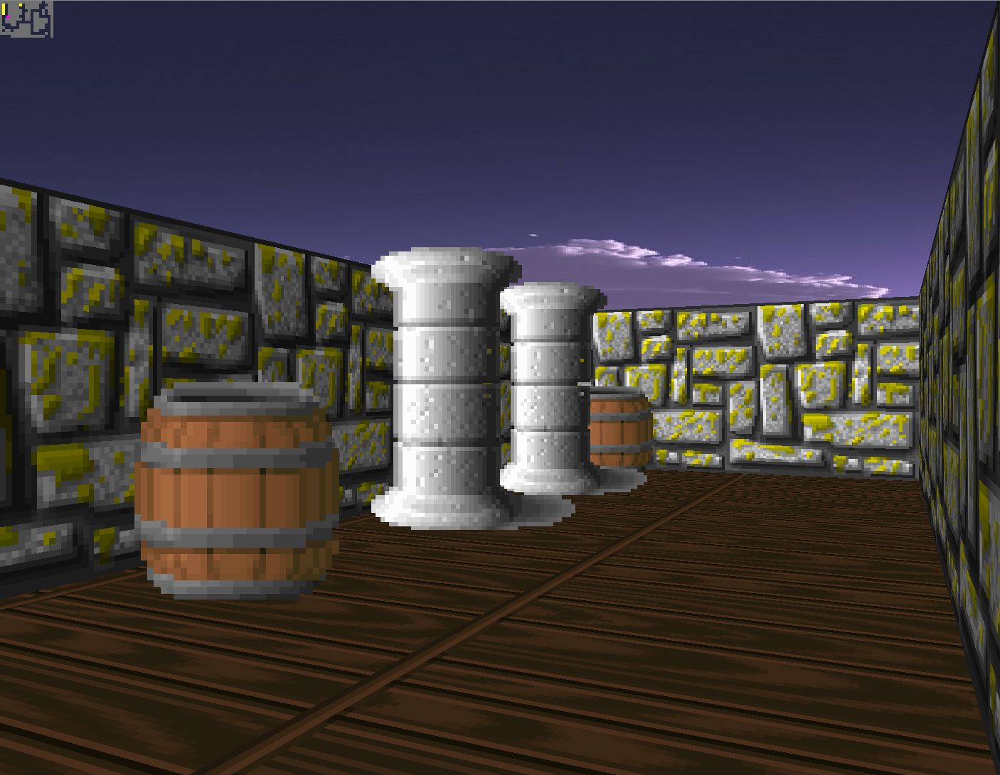

# 42_wolf3D

This project is a raytracer, as in the game `Wolfenstein 3D` without the game aspect (no ennemy, no story...).

## Use : 
`./wolf3d maps/mapX` where `mapX` is a valid map.

### Feature
* Skybox
* minimap
* Sprites
* wall texture
* ground texture (bug know when jump)
* hit-box (squared)
* Multithread
* Resize (it's not the SDL scaling, but a new image with new ratio => bug known on sprite)
* jump (not perfect at all with ground texture)
* map parser of any regular file (so don't try */dev/urandom*, it could take a while, and a stackoverflow)

I used SDL compiled from source for this project (.tar in the repo)

### How it looks ?

